# Задача 1. Анализ безопасности системы

## 1. Конфиденциальные данные и диаграммы потоков данных (As-Is)

### 1.1. Конфиденциальные данные

На основе анализа контекста компании "Медикаменте" ниже перечислены категории конфиденциальных данных и места их появления в текущих процессах.

**Персональные данные (ПДн), подлежащие учёту по 152-ФЗ**

| Категория | Примеры | Где хранится/обрабатывается сейчас | Учтено в системах? |
|-----------|---------|-------------------------------------|--------------------|
| **Идентификационные** | Ф.И.О., дата рождения | Excel (пациенты), папки пациентов, журналы записей | Нет — файлы без классификации и разграничения доступа |
| **Контактные** | Телефон, e-mail | Excel, журналы, сканы документов | Нет |
| **Расширенная анкета** | Адрес прописки, место работы/учёбы, хронические заболевания | Сканы, PDF, ручные формы на общем диске | Нет — в одной куче с остальными файлами |
| **Медицинские данные** | Медкарты, заключения, результаты анализов | Папки пациентов (Excel, JPG, PDF), реестры анализов (Excel) | Нет — доступ по общему диску без аудита |
|

**Данные, связанные с платежами и учётом**

| Категория | Примеры | Где хранится/обрабатывается | Учтено? |
|-----------|---------|-----------------------------|---------|
| Платёжные операции | Суммы, даты, привязка к пациенту/услуге | Excel (двойной учёт), 1С:Бухгалтерия, ККМ | Частично — в 1С есть учёт, но связь между Excel и 1С не контролируется |
| Кадровые и зарплатные данные | Ф.И.О. сотрудников, зарплата, налоги | 1С:Бухгалтерия | Частично — только в 1С, без выделенной политики доступа к ПДн |
|

**Выявленные проблемы по работе с данными:**

- **Классификация и метки конфиденциальности** — ни в Excel, ни на файловом сервере нет тегов или атрибутов «персональные», «медицинская тайна», «платёжные».
- **Медицинская тайна** — содержимое медкарт и анализов хранится в общих папках; разграничение доступа только на уровне домена, без ролей и аудита.
- **Цепочка обработки (Data Lineage)** — неизвестно, кто, когда и откуда копировал файлы, кто имел доступ к реестрам Excel.
- **Право на удаление/прекращение обработки** — нет регламента и технической возможности полного удаления данных пациента по запросу.

---

### 1.2. Диаграммы потоков данных по процессам

Диаграммы построены в **нотации Гейна — Сарсона**. Используются пять компонентов:

| Компонент | Обозначение на диаграмме |
|-----------|--------------------------|
| **Источники данных** | Прямоугольник — это исходные точки, в которых собираются данные. Например, формы ввода данных пользователем, датчики. |
| **Процессы** | Скруглённый прямоугольник с номером и названием (место в системе и функция) |
| **Хранилища данных** | Символ хранилища (цилиндр), идентификатор D1, D2… и название |
| **Потоки данных** | Стрелки с подписью типа данных (электронные, письменные, устные) |
| **Внешние субъекты** | Прямоугольник с загруглёнными углами — системы или лица вне границы системы (пациент, ККМ, лаборатория и т.д.) |
|

Для каждого ключевого процесса построена отдельная DFD уровня 0–1. На диаграммах отмечены конфиденциальные данные в потоках. Для построения диаграмм используется инструмент [Mermaid](https://mermaid.ai/).

### 1.3. [DFD-1-ASIS]: Запись пациента и ведение журналов

**Участники:** Пациент, сотрудник ресепшена.  
**Данные:**

- Ф.И.О., дата рождения, телефон, e-mail;
- запись к специалисту;
- при необходимости — расширенная анкета (адрес, работа, здоровье).

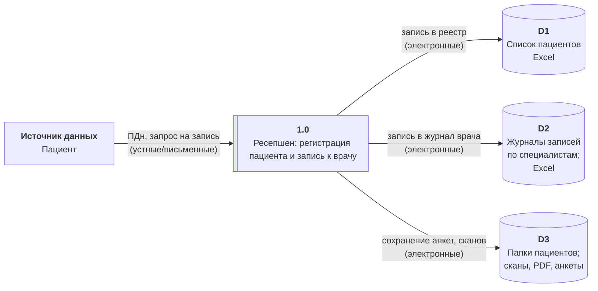
[Запись пациента и ведение журналов](./asset/dfd_1_asis.png)

**Операции над данными:** приём ПДн от пациента (устно/на бумаге), ввод в Excel, сохранение файлов в общую папку. Копирование и изменение файлов не логируются.

---

### 1.4. [DFD-2-ASIS]: Приём платежей и учёт

**Участники:** Пациент, кассир.  
**Данные:** 

- факт оплаты, её сумма и привязка к пациенту/услуге; 
- в 1С — бухгалтерские проводки и связь с ККМ.

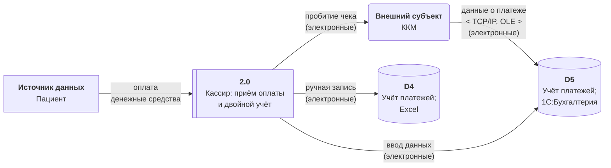
[Приём платежей и учёт](./asset/dfd_2_asis.png)

**Операции над данными:** приём денег, фиксация в ККМ и передача в 1С по OLE; параллельно ручное дублирование в Excel. Идентификация пациента в Excel и 1С может содержать Ф.И.О. или другие ПДн.

---

### 1.5. [DFD-3-ASIS]: Медицинские карты и анализы

**Участники:** Ресепшен, медицинский специалист, (в перспективе — лаборатория).  
**Данные:** медкарты, заключения, результаты анализов, реестры анализов (с привязкой к пациенту).

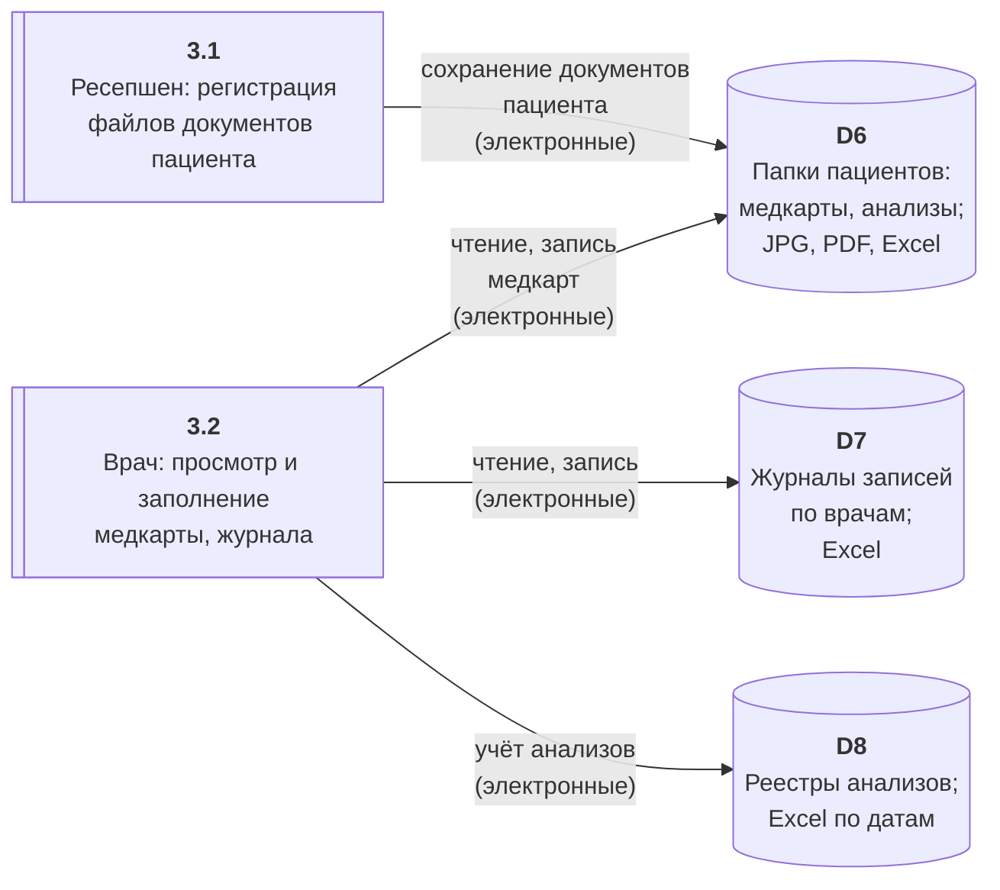
[Медицинские карты и анализы](./asset/dfd_3_asis.png)

**Операции над данными:** сохранение и изменение файлов в общих папках, ведение реестров анализов в Excel. Доступ только по домену, без разграничения по ролям и без аудита доступа к медданным.

---

### 1.6. [DFD-4-ASIS]: Бухгалтерия и кадры

**Участники:** Бухгалтер.  
**Данные:** платежи, зарплата, кадры, налоги; в 1С хранятся ПДн сотрудников и данные о контрагентах/пациентах (если используются в проводках).

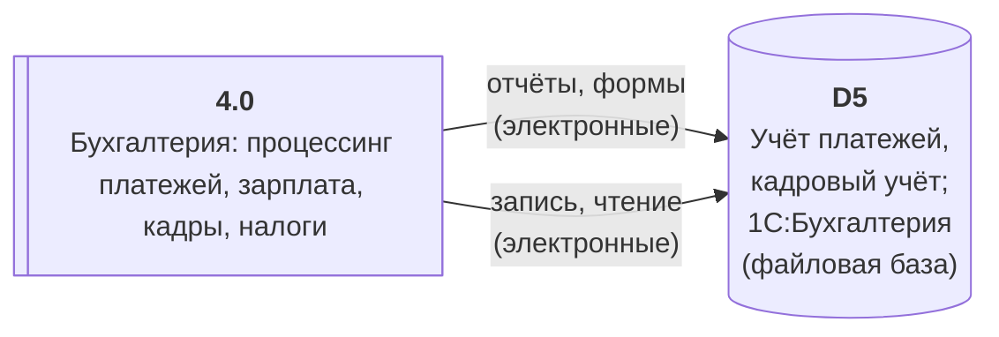
[Бухгалтерия и кадры](./asset/dfd_4_asis.png)

**Операции над данными:** работа в 1С в файловом режиме. Конфиденциальность зависит только от доступа к файлам 1С и домену; нет отдельной политики для ПДн и медданных.

---

### 1.7. [DFD-5-ASIS]: Склад и ТМЦ

**Участники:** Сотрудник склада.  
**Данные:** товарно-материальные ценности, закупки. Минимум ПДн, но система связана с 1С:Бухгалтерия (обмен данными).

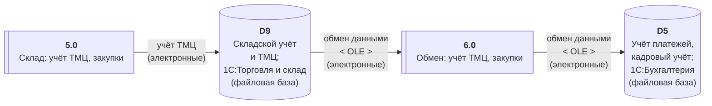
[Склад и ТМЦ](./asset/dfd_5_asis.png)

**Операции над данными:** ввод и учёт в 1С:Торговля; обмен с бухгалтерией по OLE. Потоки в основном не персональные, но общая инфраструктура (файловый режим, доступ) не изолирована от процессов с ПДн.

---

### 1.8. [DFD-6-ASIS]: Общая среда (файловый сервер, почта)

**Участники:** Все сотрудники.  
**Данные:** любые файлы с ПДн и медданными, пересылаемые по почте или лежащие на общем диске.

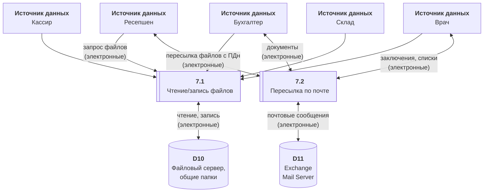
[Общая среда (файловый сервер, почта)](./asset/dfd_6_asis.png)

**Операции над данными:** хранение и передача файлов без классификации и без контроля того, кто что открывал или пересылал.

---

# 2. Аудит мер по обеспечению безопасности данных

В рамках аудита были сопоставлены текущие процессы компании "Медикаменте" с требованиями по защите конфиденциальных данных (152-ФЗ, отраслевые практики, Privacy by Design, Data Minimization, Data Lineage) и фиксирует список проблемных зон.

[Список проблемных зон](./security-audit-problem-areas.md)

---

# 3. Защита данных: матрица, тегирование и меры по потокам

## 3.1. Список данных для защиты и их способы защиты

Для каждой категории данных указаны рекомендуемые способы: **шифрование**, **обфускация**, **обезличивание** — в зависимости от сценария (хранение, передача, аналитика, интеграции).

| Категория данных | Примеры | Хранение | Передача | Использование в отчётах / интеграциях |
|--|--|--|--|--|
| **Ф.И.О., дата рождения** | Идентификация пациента | Шифрование (поля или хранилища) | TLS и минимизация в API (только при необходимости) | Обфускация или обезличивание (псевдонимы, хеши) в BI и при экспорте в лабораторию |
| **Телефон, e-mail** | Контакты | Шифрование | Не передавать без необходимости; при передаче использовать только защищённые каналы | Обфускация (маскирование) в логах и отчётах |
| **Адрес, место работы/учёбы** | Расширенная анкета | Шифрование | Не включать в API партнёров без обоснования | Обезличивание в аналитике |
| **Хронические заболевания, диагнозы, медкарты** | Медицинская тайна | Шифрование; отдельное хранилище/раздел с усиленным доступом | Только по авторизованным каналам (TLS, аутентификация); в API — маскирование или только идентификатор | Полное обезличивание для BI/ML; в отчётах — только агрегаты |
| **Результаты анализов** | Лабораторные данные | Шифрование; привязка к пациенту через идентификатор, не Ф.И.О. в открытом виде | В интеграции с лабораторией — контракт без передачи лишних ПДн; передача только по защищённому каналу | Обезличивание для статистики и обучения моделей |
| **Платёжные данные (сумма, дата, привязка к пациенту)** | Оплата услуг | Шифрование в БД; в 1С — разграничение доступа | интеграция ККМ и 1С через защищённый канал; не передавать во внешние системы без маскирования | Обфускация в отчётах (агрегаты, без привязки к Ф.И.О. где не нужно) |
| **Кадровые и зарплатные данные** | Ф.И.О. сотрудников, зарплата | Шифрование; доступ только ролям бухгалтерии/кадров | Внутренние каналы с аутентификацией | Агрегаты без персональной привязки в общих отчётах |
|

---

## 3.2. Механизм тегирования данных

Цель тегирования — помечать данные по категориям конфиденциальности и назначению, чтобы автоматически применять политики доступа, шифрования, аудита и ограничений на передачу.

### 3.2.1. Классификация тегов

Предлагается два уровня: **тип данных** и **уровень чувствительности**.

**Тип данных (категория):**

| Тег | Описание | Примеры полей/объектов |
|-----|----------|-------------------------|
| `pii:identity` | Идентификационные ПДн | Ф.И.О., дата рождения, СНИЛС/документ |
| `pii:contact` | Контактные ПДн | Телефон, e-mail |
| `pii:address` | Адресные и прочие анкетные данные | Адрес, место работы/учёбы |
| `health:clinical` | Медицинские данные (медтайна) | Диагнозы, заключения, медкарты |
| `health:lab` | Результаты анализов | Лабораторные показатели, реестры анализов |
| `financial:payment` | Платёжная информация | Суммы, даты, привязка к пациенту/услуге |
| `financial:hr` | Кадровые и зарплатные данные | Зарплата, кадровые данные сотрудников |
| `operational` | Операционные данные без ПДн | Журналы записей по идентификаторам (без Ф.И.О. в одном объекте), номенклатура ТМЦ |

**Уровень чувствительности:**

| Тег | Описание | Политика по умолчанию |
|-----|----------|------------------------|
| `sensitivity:high` | Специальные категории, медданные, финансовые персональные | Шифрование, строгий RBAC/ABAC, полный аудит, не передавать вовне без обезличивания |
| `sensitivity:medium` | ПДн идентификационные и контактные | Шифрование, разграничение доступа, аудит, в API — минимизация |
| `sensitivity:low` | Операционные данные с минимальной идентификацией | Доступ по ролям, базовый аудит |

### 3.2.2. Правила присвоения тегов

- **Файлы (Excel, PDF, JPG)** в общих папках: теги задаются на уровне папки/метаданных файла (например, для папки «Медкарты» устанавливаются теги `health:clinical`, `sensitivity:high`). При переходе в централизованное хранилище — теги на уровне документа/записи.
- **Базы данных (в т.ч. будущее единое хранилище):** теги на уровне столбцов/полей (например, столбцу `patient_name` устанавливаются теги `pii:identity`, `sensitivity:medium`).
- **API (интеграция с лабораторией, партнёры):** контракты помечаются тегами передаваемых полей; поля с `pii:*` и `health:*` не передаются без необходимости или передаются в обезличенном/токенизированном виде.
- **Экспорт и отчёты:** любой экспорт с тегами `pii:*` или `health:*` должен проходить через политику обфускации/обезличивания и логироваться.

### 3.2.3. Инструменты и реализация тегирования

- **Файловые хранилища (текущие папки):**  
  - Использование атрибутов файловой системы или метаданных (например, классификация в Windows Server или аналог для Linux), либо единый каталог метаданных (база или конфиг) с привязкой пути/имени к тегам.  
  - При миграции в систему управления документами — теги в метаданных документа (например, Elastic/OpenSearch, документальная БД).

- **Базы данных (будущая единая система, 1С, озеро данных):**  
  - Столбцы/поля аннотируются тегами в метаданных (Data Catalog: Apache Atlas, OpenLineage, или встроенные механизмы облачных хранилищ).  
  - Для 1С — описание полей с конфиденциальными данными в реестре и применение политик на уровне доступа и логирования.

- **Пайплайны и интеграции:**  
  - В ETL/интеграциях (Airflow, Kafka, API-шлюз) — правила: «все поля с тегом `pii:*` при экспорте в лабораторию маскировать или не передавать».  
  - Теги в контрактах API (OpenAPI-расширения или отдельный реестр «какие поля в каком API считаются конфиденциальными»).

- **Релизы и мониторинг (из целей компании):**  
  - В CI/CD — автоматические проверки: тегированные поля не попадают в логи, не передаются в внешние вызовы без политик.  
  - В мониторинге и алертинге — события доступа к объектам с `sensitivity:high` и нестандартные выборки по тегированным данным.

---

## 3.3. Инструменты, способы и меры по потокам

Ниже — список инструментов и мер по этапам потоков (ввод, хранение, обработка, передача, интеграции, аналитика).

### Ввод и регистрация данных

| Мера | Инструмент / способ | Потоки |
|------|---------------------|--------|
| Минимизация собираемых полей | Регламенты ввода и проработанные формы (с обязательными/опциональными полями); в будущем — портал с ограниченным набором полей | Ресепшен, анкеты |
| Валидация и санитизация на входе | Валидаторы в формах, а при импорте Excel — проверка типов и диапазонов | Все потоки с ручным вводом |
| Немедленная маркировка тегами при создании записи | Классификация при сохранении (по типу формы или разделу внутри неё) | Ресепшен, медкарты, платежи |
|

### Хранение

| Мера | Инструмент / способ | Потоки |
|------|---------------------|--------|
| Шифрование данных в покое | Шифрование Full-disk или на уровнях БД и файлового хранилища | Все хранилища с ПДн и медданными |
| Разграничение доступа по ролям | RBAC в приложениях и в AD (группы по ролям); для файлов — права на папки по ролям до перехода в единую систему | Ресепшен, медкарты, бухгалтерия, кассиры |
| Аудит доступа к конфиденциальным данным | Логирование доступа к файлам (audit log файл-сервера), к записям в БД (audit tables или СУБД audit); SIEM для агрегации | Все процессы с тегами `sensitivity:high/medium` |
| Изоляция особо чувствительных данных | Отдельные тома/разделы/схемы БД для медданных; отдельные папки с усиленными правами | Медкарты, анализы |
|

### Обработка и приложения

| Мера | Инструмент / способ | Потоки |
|------|---------------------|--------|
| Маскирование в интерфейсах | Отображение телефона/ e-mail частично скрытыми для ролей, которым полные данные не нужны | Ресепшен, кассиры, отчёты |
| Запрет экспорта и копирования без необходимости | Политики DLP, ограничение копирования из приложений; логирование экспорта | Все приложения с ПДн/медданными |
| Сессионный контроль и таймауты | Ограничение времени сессии и блокировка после неактивности для приложений с доступом к конфиденциальным данным | Портал, 1С, доступ к папкам |
|

### Передача

| Мера | Инструмент / способ | Потоки |
|------|---------------------|--------|
| Шифрование при передаче | TLS 1.2+ для всех соединений (веб, API, почта по TLS); при необходимости — шифрование тела сообщений | интеграция ККМ и 1С, почта, будущие API |
| Ограничение передаваемых полей в интеграциях | Контракты API без лишних ПДн; в ответах лаборатории — только идентификатор заказа и результат по авторизованному запросу | Интеграция с лабораторией, партнёры |
| Контроль пересылки по почте | Политики почты: предупреждение и блокировка вложений с ключевыми словами или тегами; обучение сотрудников | Exchange, внутренняя переписка |
|

### Интеграции (лаборатория, партнёры)

| Мера | Инструмент / способ | Потоки |
|------|---------------------|--------|
| API-шлюз с валидацией и маскированием | Шлюз (напримре, Kong или встроенный в приложение) и настроенные правила: подстановка токенов вместо Ф.И.О., логирование вызовов без тела с ПДн | Лаборатория, будущие партнёры |
| Контракты с явной категоризацией полей | OpenAPI и, возможно, кастомные расширения с тегами конфиденциальности; код-ревью контрактов | Все новые API |
| Аутентификация и авторизация партнёров | OAuth2/API-ключи, scope по ресурсам (например, только "результаты по заказу на исследование") | Лаборатория, партнёры |
|

### Аналитика, BI, ML/AI

| Мера | Инструмент / способ | Потоки |
|------|---------------------|--------|
| Обезличенные копии для аналитики | ETL с обезличиванием (агрегаты, псевдонимы, удаление идентификаторов) в озеро данных; тегирование набора как `anonymized` | Озеро данных, BI, ML |
| Доступ к сырым конфиденциальным данным только по обоснованному запросу | Заявки на доступ, логирование запросов к сырым данным с тегами `sensitivity:high` | Внутренние отчёты, расследования |
| Проверки в CI/CD для тегированных данных | Скрипты/правила в пайплайне: отсутствие логирования полей с тегами, проверка контрактов API на отсутствие лишних ПДн | Релизы новых сервисов |
|

### Организационные меры

| Мера | Описание |
|------|----------|
| Регламент обработки ПДн и медданных | Документ с целями, основаниями, сроками хранения и процедурами удаления по запросу субъекта |
| Обучение сотрудников | Регулярные инструктажи по работе с конфиденциальными данными и инцидентам |
| Реагирование на инциденты | Регламент по утечкам и несанкционированному доступу; интеграция алертов из SIEM/аудита с командой безопасности |
| Регулярный пересмотр прав доступа | Аудит прав к папкам, 1С и приложениям; отзыв при смене роли/увольнении |
|

---

# 4. Доработанные диаграммы потоков данных (To-Be) с мерами защиты

## 4.1. [DFD-1-TOBE]: Запись пациента и ведение журналов

**Меры по этапам:**

- **Ввод:** минимизация полей в формах; валидация; при сохранении — немедленная маркировка тегами (`pii:identity`, `pii:contact`, при расширенной анкете — `pii:address`, `sensitivity:medium/high`).
- **Хранение:** данные в защищённом хранилище (шифрование в покое); доступ по ролям (только ресепшен и уполномоченные врачи к папкам пациентов); аудит доступа к объектам с тегами.
- **Передача в папки/хранилище:** только по защищённому каналу; не дублировать в открытые общие папки.

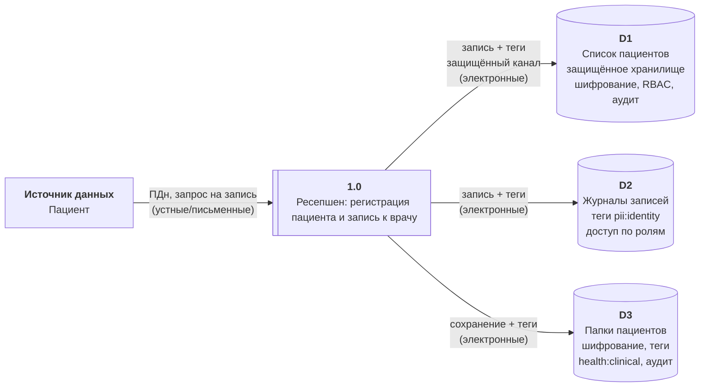
[Запись пациента и ведение журналов](./asset/dfd_1_tobe.png)

---

## 4.2. [DFD-2-TOBE]: Приём платежей и учёт

**Меры по этапам:**

- **Приём оплаты:** минимум ПДн в интерфейсе кассира (маскирование телефона/Ф.И.О. где возможно); логирование операций.
- **Интеграция ККМ и 1С:** защищённый канал (TLS/шифрование); в 1С — поля с привязкой к пациенту с тегами `financial:payment`, шифрование чувствительных полей.
- **Excel (при временном сохранении):** уйти от двойного учёта; если Excel остаётся — только в защищённой зоне с тегами и аудитом; в перспективе — единая система без Excel.
- **Доступ к 1С:** RBAC (кассиры — ограниченный набор операций; бухгалтерия — полный доступ с аудитом).

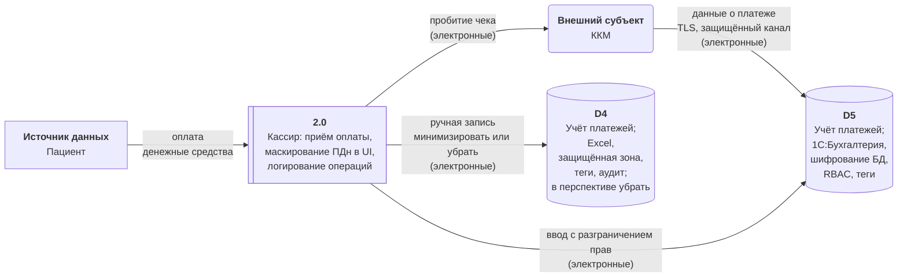
[Приём платежей и учёт](./asset/dfd_2_tobe.png)

---

## 4.3. [DFD-3-TOBE]: Медицинские карты и анализы

**Меры по этапам:**

- **Регистрация файлов ресепшеном:** теги `health:clinical` / `health:lab`, `sensitivity:high`; сохранение только в изолированное хранилище с шифрованием.
- **Доступ врача:** только к своим журналам и к медкартам в рамках назначения (RBAC/ABAC); полный аудит доступа к объектам с тегами `health:*`.
- **Реестры анализов:** хранить с тегами; при интеграции с лабораторией — передавать только идентификаторы и получать результаты по защищённому API без лишних ПДн в контракте.
- **Передача между системами:** только по защищённым каналам; при экспорте — обфускация/обезличивание по политике.

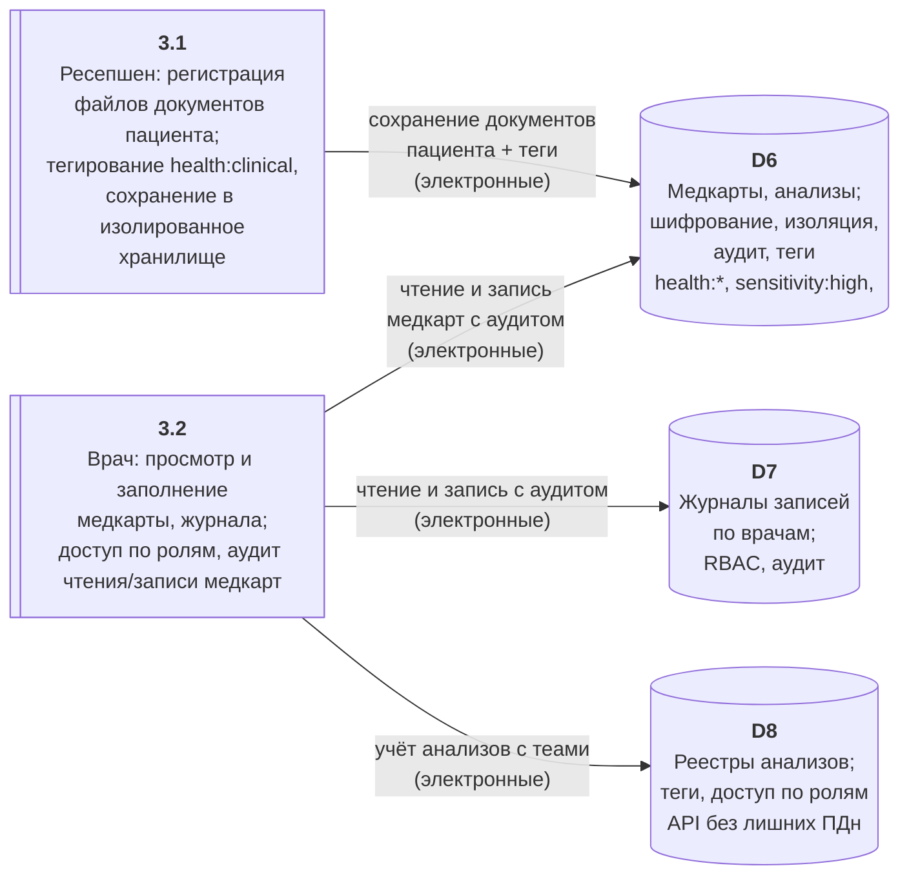
[Медицинские карты и анализы](./asset/dfd_3_tobe.png)

---

## 4.4. [DFD-4-TOBE]: Бухгалтерия и кадры

**Меры по этапам:**

- **Доступ к 1С:** строгий RBAC (только бухгалтерия/кадры); многофакторная аутентификация для доступа к конфиденциальным разделам; аудит доступа к данным с тегами `financial:hr`, `pii:*`.
- **Хранение:** шифрование БД 1С (или файловой базы); тегирование полей с ПДн сотрудников и платёжными данными.
- **Передача:** обмен с другими системами только по защищённым каналам; в отчётах — агрегаты без персональной привязки там, где не требуется.

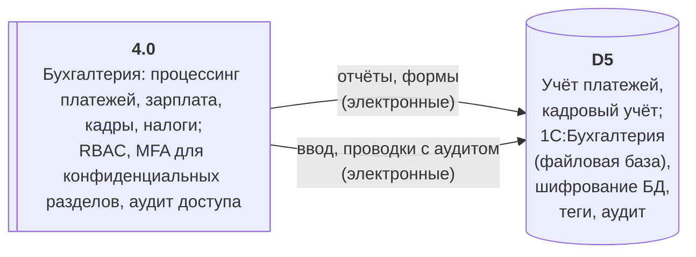
[Бухгалтерия и кадры](./asset/dfd_4_tobe.png)

---

## 4.5. [DFD-5-TOBE]: Склад и ТМЦ

**Меры по этапам:**

- Данные в основном не персональные; меры — общая инфраструктурная безопасность (шифрование, доступ по ролям), изоляция от систем с ПДн при обмене (в 1С не передавать лишние ПДн в обменах с бухгалтерией).
- Канал 1С:Торговля ↔ 1С:Бухгалтерия: защищённый; в обмене — только необходимые для учёта поля, без дублирования ПДн пациентов в складской системе.

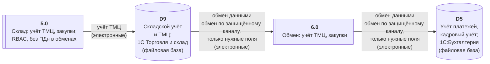
[Склад и ТМЦ](./asset/dfd_5_tobe.png)

---

## 4.6. [DFD-6-TOBE]: Общая среда

**Меры по этапам:**

- **Файловый сервер:** классификация папок (теги на уровне папок/метаданных); разграничение доступа по группам AD по ролям; шифрование томов; аудит доступа к папкам с конфиденциальными данными; по возможности — переход конфиденциальных данных в единое защищённое хранилище с тегами.
- **Почта:** политики DLP — предупреждение/блокировка вложений с конфиденциальными данными или тегами; пересылка только по TLS; обучение сотрудников не пересылать ПДн/медданные без необходимости.
- **Единая система (целевое состояние):** хранение ПДн и медданных в единой системе с тегами, RBAC, шифрованием и аудитом; файловый сервер — только для операционных, нетекстовых файлов с применением тех же мер.

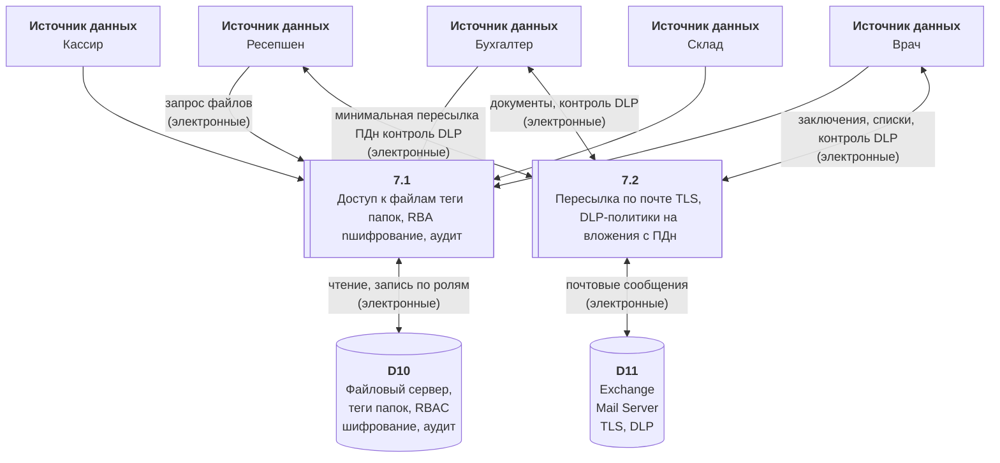
[Общая среда](./asset/dfd_6_tobe.png)
