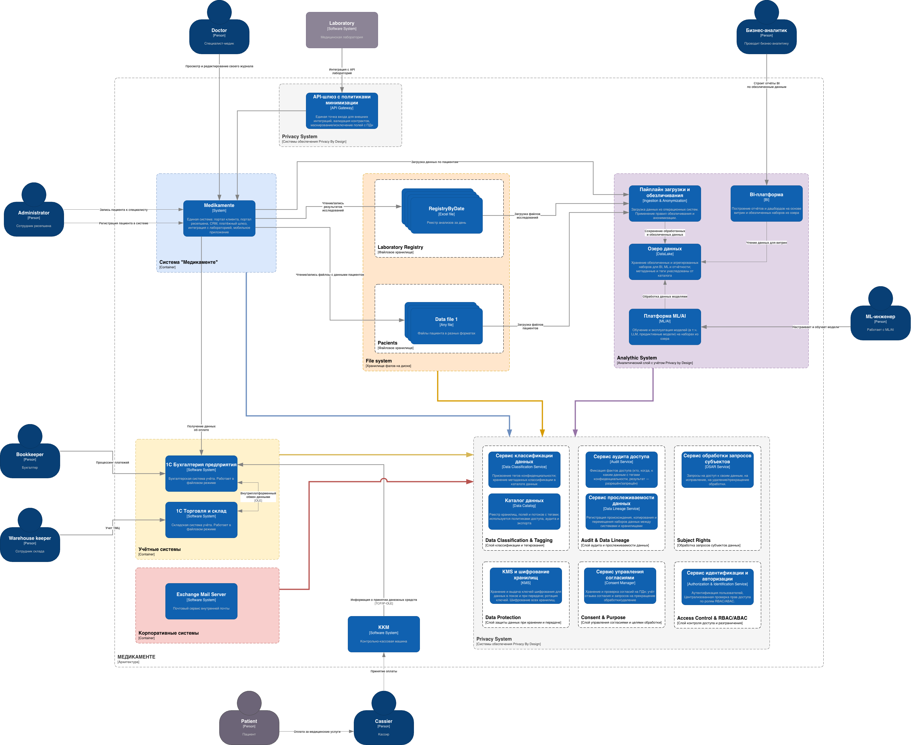

# Задание 2. Проектирование решения (Privacy by Design)

## 1. Архитектура системы (MVP)

[landscape-MWP](./landscape-MWP.drawio)

---

## 2. Компоненты, обеспечивающие Privacy by Design

### 2.1.  Слой классификации и тегирования данных (Data Classification & Tagging)

| Блок в C4 | Назначение | Принцип PbD |
|-----------|------------|-------------|
| **Сервис классификации данных (Data Classification Service)** | Присвоение тегов конфиденциальности (`pii:identity`, `health:clinical`, `sensitivity:high` и т.д.) при поступлении данных в систему; хранение метаданных классификации в каталоге данных | **Proactive, не реактивный** — данные помечаются при создании/поступлении, а не постфактум |
| **Каталог данных (Data Catalog)** | Реестр хранилищ, полей и потоков с тегами; используется политиками доступа, аудита и экспорта | **Прозрачность** — единая точка истины о том, где какие данные и какой уровень чувствительности |

Все приложения (портал клиента, портал ресепшена, CRM, интеграция с лабораторией) при записи данных обращаются к сервису классификации или получают из каталога правила тегирования, чтобы данные по умолчанию обрабатывались с учётом конфиденциальности.

---

### 2.2. Слой управления согласиями и целями обработки (Consent & Purpose)

| Блок в C4 | Назначение | Принцип PbD |
|-----------|------------|-------------|
| **Сервис управления согласиями (Consent Manager)** | Хранение и проверка согласий пациента на цели обработки ПДн; учёт отзыва согласия и запросов на прекращение обработки/удаление | **Уважение к интересам пользователя** — возможность отозвать согласие и «быть забытым» заложена в архитектуру |
| **Реестр целей обработки** (как компонент Consent Manager) | Связь целей обработки (запись к врачу, анализы, оплата, маркетинг и т.д.) с правовыми основаниями и наборами данных | **Минимизация данных** — явное определение, для какой цели какие данные нужны |

Портал клиента и ресепшен при сборе ПДн обращаются к Consent Manager; при запросе пациента на удаление данных система использует этот блок для прекращения обработки и запуска процедуры удаления/обезличивания.

---

### 2.3. Слой контроля доступа и разграничения (Access Control & RBAC/ABAC)

| Блок в C4 | Назначение | Принцип PbD |
|-----------|------------|-------------|
| **Сервис авторизации (Authorization Service)** | Централизованная проверка прав доступа по ролям (RBAC) и/или атрибутам (ABAC) с учётом тегов данных и контекста (например, «врач — только свои пациенты по назначению») | **Защита по умолчанию** — доступ к конфиденциальным данным только при явном разрешении и в минимально необходимом объёме |
| **Сервис управления идентификацией (Identity Provider)** | Аутентификация пользователей (пациент, сотрудник), выдача токенов с учётом роли и scope доступа | **Безопасность на всём жизненном цикле** — единая точка входа и контроля сессий |

Все приложения и API перед выдачей данных проверяют права через Authorization Service; доступ к данным с тегами `sensitivity:high` дополнительно логируется.

---

### 2.4. Слой аудита и прослеживаемости данных (Audit & Data Lineage)

| Блок в C4 | Назначение | Принцип PbD |
|-----------|------------|-------------|
| **Сервис аудита доступа к данным (Audit Service)** | Фиксация фактов доступа (кто, когда, к каким данным с тегами конфиденциальности, результат — разрешён/запрещён) | **Подотчётность и прозрачность** — любые действия с конфиденциальными данными фиксируются |
| **Сервис прослеживаемости данных (Data Lineage Service)** | Регистрация происхождения, копирования и перемещения наборов данных между системами и хранилищами | **Прозрачность** — можно ответить на вопрос «откуда данные и куда передавались» |

Логи аудита и lineage используются мониторингом и алертингом для выявления нетипичных действий и реагирования на инциденты; при релизах проверяется работа с тегированными данными (как в целях компании).

---

### 2.5. Слой защиты данных при хранении и передаче (Data Protection)

| Блок в C4 | Назначение | Принцип PbD |
|-----------|------------|-------------|
| **Сервис управления ключами (KMS)** | Хранение и выдача ключей шифрования для данных в покое и при передаче; ротация ключей | **Безопасность полного жизненного цикла** — конфиденциальные данные шифруются по умолчанию |
| **Шифрование в хранилищах** | Все хранилища с тегированными данными (БД приложений, озеро данных) используют шифрование at rest на основе KMS | **Защита по умолчанию** |
| **TLS и защищённые каналы** | Все взаимодействия между блоками и с внешними системами — по TLS; политики на API-шлюзе | **Защита при передаче** |

Приложения и БД не хранят ключи; запросы на расшифровку идут через единый слой (KMS + политики доступа).

---

### 2.6. API-шлюз и минимизация данных при интеграциях (API Gateway & Data Minimization)

| Блок в C4 | Назначение | Принцип PbD |
|-----------|------------|-------------|
| **API-шлюз (Gateway)** | Единая точка входа для внешних интеграций (лаборатория, партнёры); валидация контрактов, маскирование/исключение полей с ПДн и медданными в запросах и ответах | **Минимизация данных** — вовне передаются только необходимые для контракта поля; конфиденциальные категории скрыты по умолчанию |

Интеграция с лабораторией и будущие партнёрские API проходят через шлюз; контракты не содержат лишних ПДн, ответы по пациентам — по идентификатору заказа/токену без передачи Ф.И.О. в открытом виде там, где это не требуется.

---

### 2.7. Обработка запросов субъектов данных (Subject Rights)

| Блок в C4 | Назначение | Принцип PbD |
|-----------|------------|-------------|
| **Сервис обработки запросов субъектов (DSAR — Data Subject Access Request)** | Приём запросов на доступ к своим данным, на исправление, на удаление/прекращение обработки; оркестрация снятия копий, исправления и удаления/обезличивания по всем системам с учётом каталога и lineage | **Уважение к интересам пользователя** — техническая возможность выполнить требования 152-ФЗ по запросу пациента |

Портал клиента и ресепшен инициируют запросы; сервис координирует приложения и хранилища, использует Consent Manager и каталог данных.

---

## 3. Аналитический слой с учётом Privacy by Design

В целевой архитектуре предлагается выделенный **слой аналитической работы с данными**, который обеспечивает построение BI, использование ML/AI и ведение отчётности с соблюдением принципов Privacy by Design и требований к конфиденциальности (152-ФЗ, медицинская тайна).

Предполагается выделение следующих компонентов системы:

- **Зона приёма и обезличивания (Ingestion & Anonymization)**  
Все данные, попадающие в озеро из систем с ПДн и медданными, проходят через пайплайн с правилами обезличивания, согласованными с каталогом данных и реестром целей обработки.
- **Хранилище аналитических данных (Data Lake / DWH)**  
Озеро интегрировано с сервисом Data Lineage: откуда данные поступили, какие преобразования применены и куда передаются — фиксируется для подотчётности и реагирования на запросы субъектов (DSAR).
- **BI, отчётность и визуализация**  
Бизнес-аналитик и другие пользователи работают в основном с обезличенными данными; запросы к сырым или персональным данным выполняются через отдельный регламент и логируются.
- **ML / AI и обучение моделей**
Обучение на реальных ПДн/медданных — только в изолированных проектах с отдельным согласованием, обезличиванием и аудитом.

Аналитический слой использует общие сервисы целевой архитектуры:

- **Каталог данных и теги** — для определения правил обезличивания при загрузке в озеро и для политик доступа к витринам.
- **Сервис авторизации** — для разграничения доступа к BI, витринам и наборам в озере.
- **Сервис аудита** — для фиксации доступа к аналитическим данным.
- **Data Lineage** — для прослеживания данных от источников до отчётов и моделей.
- **Сервис обработки запросов субъектов (DSAR)** — при запросе на удаление/прекращение обработки данные субъекта в озере и производных наборах помечаются к удалению или дополнительному обезличиванию в соответствии с политиками жизненного цикла.