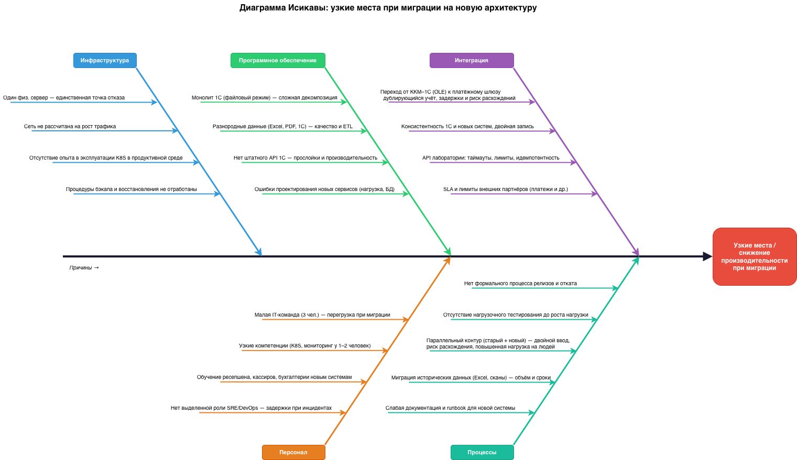

# Задание 4. Оценка узких мест при миграции

## 1. Диаграмма Исикавы

Диаграмма «Рыбья кость» построена для эффекта **«Узкие места / снижение производительности при миграции на новую архитектуру»**.

[ishikawa-migration.drawio](./ishikawa-migration.drawio)

**Основные категории причин (кости диаграммы):**

1. **Инфраструктура** — железо, сеть, платформа (Kubernetes), резервное копирование.
2. **Программное обеспечение** — монолит 1С, качество и разнородность данных, проектирование новых сервисов.
3. **Интеграция** — 1С–новые системы, ККМ, лаборатория, партнёры, контракты API.
4. **Персонал** — численность IT, компетенции, обучение пользователей, роли SRE/DevOps.
5. **Процессы** — управление релизами, тестирование, параллельный контур, миграция данных, документация.

---