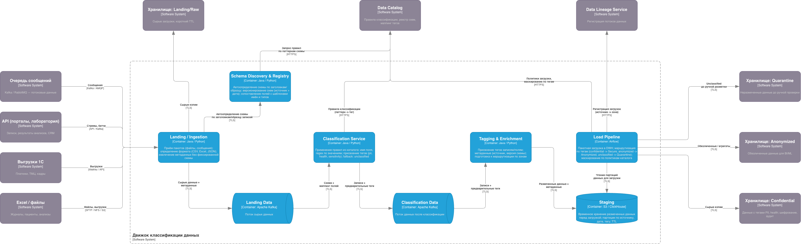

# Задание 6. Классификация данных

## 1. Движок классификации данных перед загрузкой в хранилище

### 1.2. Архитектура движка (контейнеры)

[c4-container-classification-engine.drawio](./c4-container-classification-engine.drawio)

Движок реализован как пайплайн из следующих контейнеров:

- **Landing / Ingestion**  
Приём сырых пакетов (файлы, очереди), определение формата (CSV, Excel, JSON, Parquet), разбор без жёсткой привязки к фиксированной схеме
- **Schema Discovery & Registry**  
Автоопределение схемы по заголовкам/образцу записей, регистрация версий схемы (источник + дата среза), сопоставление полей с шаблонами (например, "похоже на ФИО", "телефон")
- **Classification Service**  
Применение правил классификации: по имени поля (словарь + регулярные выражения), по образцам значений (regex, маски), опционально — ML-модель для текстовых полей
- **Data Catalog (правила и теги)**  
Хранение правил классификации (паттерн -> тег), реестр схем, маппинг "источник — зона назначения".
- **Tagging & Enrichment**  
Присвоение тегов записям/полям, добавление метаданных (источник, версия схемы, дата классификации), подготовка к маршрутизации.
- **Staging**  
Временное хранилище размеченных данных перед загрузкой в DWH/озеро; партиционирование по источнику, дате, тегу конфиденциальности.
- **Load Pipeline**  
Пакетная загрузка из Staging в хранилище с маршрутизацией: конфиденциальные данные — в защищённую зону; обезличенные/агрегаты — в зону аналитики; применение маскирования/агрегации по политикам каталога.

Обработка **структурных изменений**: при появлении новой версии схемы (новые/переименованные поля) Schema Discovery регистрирует её; правила в каталоге применяются по паттернам (имя, тип, примеры). Поля, не попавшие ни под одно правило, получают тег «unclassified» и направляются в зону с ограниченным доступом и очередью на ручную разметку, что затем пополняет правила в каталоге.

Обработка **отсутствия разметки**: классификация выполняется по правилам (словарь, regex, при необходимости ML); результат — явные теги на каждом поле/записи. Отсутствие разметки на входе компенсируется тем, что разметка создаётся движком до попадания данных в основное хранилище.

---

## 2. Организация слоёв в хранилище данных и прочие меры

В хранилище будут частично храниться конфиденциальные данные (например, для отчётности по субъекту, аудита, выполнения DSAR).

### 2.1. Слои в хранилище данных

| Зона | Содержимое | Режим доступа и меры |
|------|------------|----------------------|
| **Landing / Raw** | Сырые загрузки до классификации (минимальный срок хранения) | Шифрование at rest; доступ только сервисам движка и ограниченному кругу администраторов; логирование доступа; быстрый TTL (например, 7–14 дней) с последующим удалением или переносом только в размеченном виде в другие зоны. |
| **Confidential / Secure** | Данные с тегами высокой конфиденциальности (PII, медицинские), необходимые для регламентированных сценариев | Отдельные партиции/схемы/базы; шифрование at rest (TDE или шифрование на уровне приложения с KMS); доступ только по RBAC/ABAC с обоснованием; полный аудит доступа; политики маскирования при выводе в BI; поддержка DSAR (поиск и удаление/обезличивание по субъекту) |
| **Anonymized / Aggregated** | Обезличенные и агрегированные данные для BI, отчётности, ML | Доступ по ролям аналитиков; без прямых идентификаторов; аудит доступа; использование для дашбордов и моделей по умолчанию |
| **Unclassified / Quarantine** | Поля или записи, не получившие уверенной классификации | Ограниченный доступ; очередь на ручную разметку; после разметки — перенос в соответствующую зону и обновление правил в каталоге |

### 2.2. Дополнительные меры

- **Политики жизненного цикла и хранения:** максимальные сроки хранения по зонам и тегам (в т.ч. 152-ФЗ); автоматическое удаление или обезличивание по истечении срока.
- **Column-level и row-level security:** в СУБД/озере — ограничение доступа к столбцам/строкам по ролям и атрибутам (ABAC), согласованное с тегами из каталога.
- **Динамическое маскирование в BI:** при запросах к конфиденциальной зоне — маскирование по политикам (например, показ только последних цифр телефона) без изменения самих данных в хранилище.
- **Data Lineage:** фиксация происхождения данных, применённых правил классификации и цепочек загрузки из движка в зоны — для аудита и DSAR.
- **Интеграция с DSAR:** при запросе субъекта на удаление/прекращение обработки — поиск по каталогу и lineage, удаление/обезличивание во всех зонах (в т.ч. конфиденциальной и кэшах отчётов).

---

## 3. Метрики эффективности классификации и оптимизация системы

| Метрика | Описание | Как помогает в оптимизации |
|---------|----------|----------------------------|
| **Coverage (покрытие)** | Доля полей/записей, получивших хотя бы один тег конфиденциальности (в т.ч. "unclassified") | Рост доли неразмеченных полей — сигнал к доработке правил или ручной разметке; целевое значение — близко к 100% полей с явным тегом |
| **Precision / Recall по классам** | Точность и полнота отнесения к классам (`PII`, `health` и т.д.) при наличии эталонной выборки (ручная разметка, выборочный аудит) | Низкая точность -> много ложных срабатываний, избыточное ограничение доступа; низкая полнота -> риск попадания конфиденциальных данных в открытую зону; баланс precision/recall задаёт пороги правил и моделей |
| **Доля записей в Quarantine** | % записей/полей, попавших в зону "unclassified" | Рост — необходимость дообучения правил или моделей; снижение после доработок — показатель улучшения движка |
| **Latency / Throughput пайплайна** | Время от появления данных в Landing до появления в целевой зоне хранилища; объём обработанных записей в единицу времени | Выявление узких мест (Schema Discovery, Classification, Load); оптимизация параллельной обработки и ресурсов |
| **Consistency с каталогом** | Соответствие применённых тегов задекларированным в каталоге правилам (аудит логов классификации) | Обнаружение расхождений при обновлении правил; контроль неизменности политик в проде |
| **Частота переклассификации** | Количество полей/записей, изменивших тег при повторном прогоне после обновления правил | Оценка влияния изменений правил; планирование повторной загрузки и миграций в хранилище |
|

Использование метрик в процессе оптимизации:

- Регулярный (еженедельный/ежемесячный) отчёт по `coverage`, доле в `quarantine` и по точности/полноте на выборочных данных — для приоритизации доработок правил и обучения моделей.
- Мониторинг `latency` и `throughput` — для масштабирования воркеров и настройки батчинга.
- Алерты при падении `coverage` или росте доли в `quarantine` выше порога — для своевременной реакции на появление новых форматов/полей без правил.

---

## 4. Масштабируемость и расширение системы

Масштабирование при росте объёма данных:

- **Горизонтальное масштабирование воркеров классификации:** контейнеры Classification Service и Tagging выполняются как отдельные воркеры за очередью (Kafka, RabbitMQ, SQS); увеличение числа воркеров при росте объёма загрузок. Очередь после Landing партиционируется по источнику/дате для параллелизма.
- **Партиционирование в Landing и Staging:** данные разбиваются по источнику, дате загрузки и (опционально) по хэшу ключа; каждая партиция обрабатывается независимо, что позволяет распараллеливать и перезапускать только неудачные партиции.
- **Пакетная загрузка в хранилище:** Load Pipeline пишет в DWH/озеро партициями; использование bulk-операций и форматов колоночных хранилищ для ускорения записи; при необходимости — несколько инстансов загрузки с разделением по зонам или партициям.
- **Schema Registry и каталог:** централизованные; рост числа источников и версий схем компенсируется кэшированием правил на воркерах и масштабированием БД каталога (реплики для чтения).

Масштабирование при росте числа пользователей и сценариев:

- **Доступ к хранилищу:** запросы к аналитическим зонам идут через сервис запросов (BI, API отчётов), который масштабируется горизонтально; авторизация и проверка прав (RBAC/ABAC) — через централизованный Authorization Service; кэширование результатов отчётов для снижения нагрузки на хранилище.
- **Разделение нагрузки по ролям:** аналитики по умолчанию работают с обезличенной зоной; запросы к конфиденциальной зоне — по отдельному регламенту, с логированием и лимитами, чтобы не создавать узкое место на одном кластере.
- **Расширение правил и источников:** добавление новых источников и полей обрабатывается за счёт регистрации новых схем в Schema Registry и добавления правил в Data Catalog без изменения кода движка; при необходимости — дообучение ML-моделей классификации на размеченных выборках и выкладка новых версий моделей.

